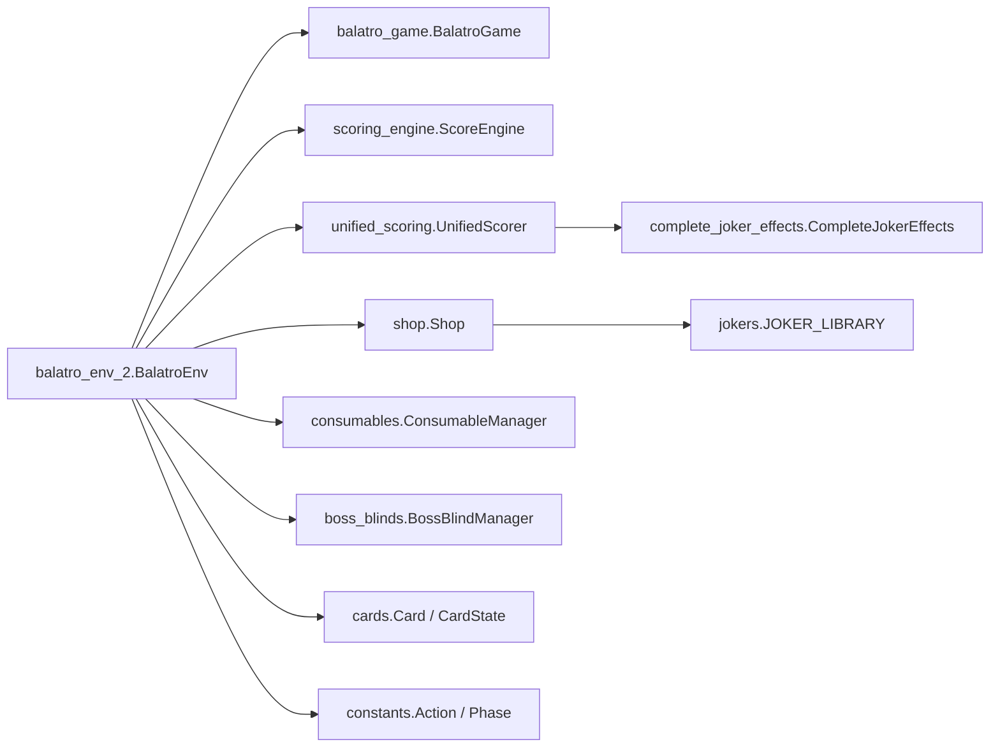

# Balatro RL Agent

This repository contains a custom `Gymnasium`-style Balatro environment plus several training scripts built around it. The current implementation is centered on `balatro_gym/balatro_env_2.py`, which integrates card logic, scoring, shop interactions, consumables, boss blinds, reward shaping, and reproducible RNG into a single environment class.

This README documents the code as it exists now, not the aspirational docstrings. Some systems are functional but simplified, and some modules are clearly partial prototypes.

## Repository Overview

The environment lives in `balatro_gym/`, while the top-level scripts are different training or experimentation entrypoints around that environment.

The core dependency structure is:



## `balatro_gym/` Module Map

### Environment and state orchestration

- `balatro_gym/balatro_env_2.py`
  Main environment implementation. Defines `BalatroEnv`, `UnifiedGameState`, deterministic RNG streams, action routing, observations, reward shaping, save/load helpers, rendering, and validation helpers.

- `balatro_gym/constants.py`
  Defines the public RL-facing enums: `Phase` and `Action`, along with action-count constants and the flat action-space size.

### Core card and scoring systems

- `balatro_gym/cards.py`
  Canonical card primitives for the environment: `Card`, `Suit`, `Rank`, `Enhancement`, `Edition`, `Seal`, helper effect classes, and mutable `CardState`.

- `balatro_gym/balatro_game.py`
  Lightweight internal game engine that tracks the hand, highlighted cards, draw/discard/play flow, and basic poker classification.

- `balatro_gym/scoring_engine.py`
  Defines `HandType`, hand base values, hand levels, and simplified score computation utilities used by the environment.

- `balatro_gym/unified_scoring.py`
  Bridges `ScoreEngine` and joker effects. It converts joker outputs into a consistent scoring format and applies them in a more structured scoring pipeline.

- `balatro_gym/complete_joker_effects.py`
  Implements a subset of joker behaviors through phase-based effect routing. It is functional for many common jokers, but it is not actually complete despite the name.

### Shop and content tables

- `balatro_gym/shop.py`
  Handles shop inventory generation, rerolls, purchases, vouchers, and pack opening at a simplified system level.

- `balatro_gym/jokers.py`
  Metadata table for joker IDs, names, costs, and effect descriptions.

- `balatro_gym/planets.py`
  Planet enum and mapping from planets to hand-type upgrades. Some planet values are explicitly placeholders.

### Additional game systems

- `balatro_gym/consumables.py`
  Tarot and spectral-card system plus a `ConsumableManager`. This module is important, but it also duplicates its own card/suit/rank types instead of reusing `cards.py`, which is a current design risk.

- `balatro_gym/boss_blinds.py`
  Boss blind definitions and boss-blind manager logic. A large set of boss blinds is declared and wired into the environment.

### Miscellaneous

- `balatro_gym/balatro_trajectories.json`
  Stored trajectory data asset.

- `balatro_gym/requirements.txt`
  Local dependency list for the gym package.

## Environment API

The main API is the `BalatroEnv` class in `balatro_gym/balatro_env_2.py`.

Supported methods and helpers:

- `reset(seed=None, options=None)`
  Reinitializes the game state, deck, score engine, shop/boss/joker subsystems, and returns `(observation, info)`.

- `step(action)`
  Validates the action against the current `action_mask`, routes it by phase, and returns `(observation, reward, terminated, truncated, info)`.

- `render()`
  Human-readable terminal rendering of the current round, hand, shop, jokers, consumables, and boss blind state.

- `save_state()`
  Serializes environment state, RNG state, score engine state, game state, and boss blind state.

- `load_state(saved_state)`
  Restores a previously saved environment state.

- `make_balatro_env(**kwargs)`
  Small factory helper returning a thunk that constructs `BalatroEnv`.

- `BalatroEnvValidator`
  Includes helper methods for determinism checking and action-mask validation.

## Observation Space

`BalatroEnv` declares a `spaces.Dict` observation space. Conceptually, the observation is organized into these groups:

- Hand state: `hand`, `hand_size`, `deck_size`, `selected_cards`
- Scoring and progress: `chips_scored`, `round_chips_scored`, `progress_ratio`, `mult`, `chips_needed`
- Economy and round context: `money`, `ante`, `round`, `hands_left`, `discards_left`
- Joker and consumable state: `joker_count`, `joker_ids`, `joker_slots`, `consumable_count`, `consumables`, `consumable_slots`
- Shop state: `shop_items`, `shop_costs`, `shop_rerolls`
- Hand progression: `hand_levels`
- Phase control: `phase`, `action_mask`
- Extra state: `hands_played`, `best_hand_this_ante`, `boss_blind_active`, `boss_blind_type`, `face_down_cards`

### Currently populated fields

The current `_get_observation()` implementation reliably fills at least these keys:

- `hand`
  An `int8[8]` array of encoded cards, with `-1` used for empty slots.

- `selected_cards`
  Binary vector over the 8 visible hand slots.

- `hand_size`, `deck_size`
  Current number of visible hand cards and current deck length.

- `chips_scored`, `round_chips_scored`, `progress_ratio`, `mult`, `chips_needed`, `money`
  Progress, score, and economy features.

- `ante`, `round`, `hands_left`, `discards_left`
  Current blind/round context.

- `joker_count`, `joker_ids`, `joker_slots`
  Joker inventory summary.

- `consumable_count`, `consumables`, `consumable_slots`
  Consumable inventory summary.

- `shop_items`, `shop_costs`, `shop_rerolls`
  Current shop information when in shop phase, otherwise default-zero arrays/scalars.

- `hand_levels`
  Encoded hand progression levels from `ScoreEngine`.

- `phase`, `action_mask`
  Current high-level phase and valid actions for that phase.

- `hands_played`, `best_hand_this_ante`
  Reward-shaping and progress history features.

- `boss_blind_active`, `boss_blind_type`, `face_down_cards`
  Boss-blind metadata.

### Declared but not fully emitted today

The observation-space declaration also includes several more advanced features, such as:

- `hand_one_hot`
- `hand_suits`
- `hand_ranks`
- `rank_counts`
- `suit_counts`
- `straight_potential`
- `flush_potential`
- `avg_score_per_hand`
- `hands_until_shop`
- `rounds_until_boss`
- `has_mult_jokers`
- `has_chip_jokers`
- `has_xmult_jokers`
- `has_economy_jokers`
- `hand_potential_scores`
- `joker_synergy_score`
- `risk_level`
- `economy_health`
- `blind_difficulty`
- `win_probability`

These are declared in `_create_observation_space()`, but they are not currently populated in the returned observation dict from `_get_observation()`. If you use the raw environment directly, that mismatch is something to keep in mind.

## Action Space

The action space is `spaces.Discrete(60)`, defined by `balatro_gym/constants.py`.

Action layout:

- `0`: `PLAY_HAND`
- `1`: `DISCARD`
- `2-9`: `SELECT_CARD_BASE + i`
- `10-14`: `USE_CONSUMABLE_BASE + i`
- `20-29`: `SHOP_BUY_BASE + i`
- `30`: `SHOP_REROLL`
- `31`: `SHOP_END`
- `32-36`: `SELL_JOKER_BASE + i`
- `37-41`: `SELL_CONSUMABLE_BASE + i`
- `45-47`: `SELECT_BLIND_BASE + i`
- `48`: `SKIP_BLIND`
- `50-54`: `SELECT_FROM_PACK_BASE + i`
- `55`: `SKIP_PACK`

Phase-specific usage:

- `Phase.PLAY`
  Card selection, `PLAY_HAND`, `DISCARD`, and consumable use.

- `Phase.SHOP`
  Buying, rerolling, ending shop, and selling jokers.

- `Phase.BLIND_SELECT`
  Choosing small, big, or boss blind, or skipping.

- `Phase.PACK_OPEN`
  Declared in the action space, but pack-open behavior is currently simplified and not a full standalone pack-selection flow.

The environment exposes an `action_mask` in the observation, and invalid actions usually return a reward of `-1.0`.

## Reward Definition

Reward shaping is concentrated in play-phase scoring, with smaller rewards in other phases.

### Play phase

Playing a hand uses the unified scorer and then applies several reward components, including:

- blind-progress reward
- milestone bonuses for crossing progress thresholds
- score-based reward
- hand-quality bonus
- efficiency bonus
- joker-synergy bonus
- strategy bonus
- ante-based bonus in later game
- blind-clear bonus

Invalid play-phase actions, such as trying to play with no selected cards, return `-1.0`.

### Discard phase

Discarding gives a small positive reward with bonuses for specific joker synergies and some context-sensitive shaping.

### Consumables

Using a consumable can give positive rewards for:

- gaining money
- upgrading a hand via planets
- affecting cards
- creating cards, jokers, or items

Failed consumable use returns `-1.0`.

### Shop phase

Shop rewards are small and event-based:

- opening a pack: positive reward
- buying a joker: larger positive reward
- buying a card: small positive reward
- buying a voucher: moderate positive reward
- selling a joker: reward proportional to sell value

### Blind select

- choosing a boss blind gives a small positive bonus
- skipping a blind applies a negative reward

### Hard guards and invalid actions

- invalid masked actions: `-1.0`
- `ante > 100`: terminate
- `chips_scored > 1_000_000_000`: terminate

## Current Feature Support

The current environment functionally supports:

- reset/step Gymnasium-style interaction
- phase-based progression across blind select, play, shop, and a simplified pack phase
- deck, hand, selection, discard, and play flow
- hand classification and level-based scoring
- joker inventory and partial joker scoring effects
- consumable inventory and partial tarot/spectral/planet effects
- shop generation, rerolls, joker purchases, vouchers, and basic pack opening
- boss blind activation and boss-blind-specific restrictions/modifiers
- deterministic RNG streams with save/load support
- human-readable rendering in terminal
- action masking

## Known Gaps And Potentially Incomplete Areas

This repo is usable, but it is not a fully faithful Balatro simulator yet.

- `balatro_gym/balatro_env_2.py`
  Pack opening is currently simplified and immediately routes back to shop instead of running a full pack-selection subgame.

- `balatro_gym/balatro_env_2.py`
  Glass-card destruction is marked as needing proper implementation.

- `balatro_gym/complete_joker_effects.py`
  Many joker effects are simplified, and end-of-round effects are mostly stubbed out.

- `balatro_gym/consumables.py`
  This module defines its own `Card`, `Suit`, and `Rank` types instead of sharing `balatro_gym/cards.py`, which creates potential mismatches.

- `balatro_gym/planets.py`
  Several planet values are explicitly placeholders.

- `balatro_gym/cards.py`
  Purple-seal tarot creation currently returns a fixed placeholder value.

- `balatro_gym/balatro_env_2.py`
  The declared observation space is broader than the currently emitted observation dict.

- `expert_agent.py`
  References missing helper methods and is not functionally complete.

- `curiculum_learning.py`
  Contains placeholder advancement logic and is not currently wired into the main training stack.

## Main Scripts Outside `balatro_gym/`

### `train_balatro_fixed.py`

Purpose:
Wraps `BalatroEnv` in `BalatroEnvFixed`, which reshapes the raw dict observation space into something Stable-Baselines3 can handle more safely, then trains PPO.

Gym pieces used:

- `balatro_gym.balatro_env_2.BalatroEnv`

Functional status:
Runnable. This is one of the clearer practical training entrypoints in the repo.

### `robust_training.py`

Purpose:
Adds a more defensive training entrypoint around `BalatroEnvFixed` with safer environment creation, Subproc-to-Dummy fallback, monitoring, and optional evaluation.

Gym pieces used:

- Indirectly uses `BalatroEnv` through `train_balatro_fixed.BalatroEnvFixed`

Functional status:
Runnable with caveats. It is mainly a robustness wrapper around the fixed environment stack.

### `hpc_train.py`

Purpose:
Simple HPC-oriented PPO training script designed to run under SLURM. `train.sbatch` launches this script.

Gym pieces used:

- `balatro_gym.balatro_env_2.BalatroEnv`

Functional status:
Runnable with environment/path caveats. It assumes a specific cluster/project layout and hard-coded path setup.

### `train_progressive.py`

Purpose:
Fine-tunes an existing PPO model using a custom `ProgressionRewardWrapper` that strongly rewards ante progression and penalizes getting stuck early.

Gym pieces used:

- Indirectly uses `BalatroEnv` through `BalatroEnvFixed`
- Uses `SafeBalatroEnv` from `robust_training.py`

Functional status:
Conditionally runnable. It assumes a valid checkpoint to load and currently hardcodes CUDA usage.

### `train_balatro_agent.py`

Purpose:
Ambitious all-in-one training script with multiple algorithms, custom feature extraction, curriculum learning, W&B logging, behavioral cloning hooks, tuning, and testing utilities.

Gym pieces used:

- `balatro_gym.balatro_env_2.BalatroEnv`
- `make_balatro_env`
- `Phase`

Functional status:
Partially complete. The training pipeline structure is broad, but some important pieces are unfinished or fragile, especially behavioral cloning and the custom feature-extractor path.

### `expert_agent.py`

Purpose:
Prototype expert policy for imitation learning or heuristic play.

Gym pieces used:

- `BalatroEnv`, `Phase`, `Action`
- `cards.Card`, `Suit`, `Rank`
- `scoring_engine.HandType`

Functional status:
Incomplete. It references undefined helper methods and uses placeholder hand evaluation.

### `curiculum_learning.py`

Purpose:
Standalone curriculum-learning wrapper that tries to modify money/joker-slot difficulty over time.

Gym pieces used:

- No direct imports from `balatro_gym`, but assumes the wrapped environment exposes `.state`

Functional status:
Incomplete and currently orphaned. The performance-tracking logic is placeholder-only.

## `train.sbatch`

`train.sbatch` is the cluster launcher for `hpc_train.py`. It loads Python/CUDA modules, activates a virtual environment, sets `PYTHONPATH`, changes into a fixed project directory, and runs `hpc_train.py` with SLURM-friendly defaults.

## Basic Usage

Minimal direct environment usage:

```python
from balatro_gym.balatro_env_2 import BalatroEnv

env = BalatroEnv(seed=42)
obs, info = env.reset()

done = False
while not done:
    valid_actions = obs["action_mask"].nonzero()[0]
    action = int(valid_actions[0])
    obs, reward, terminated, truncated, info = env.step(action)
    done = terminated or truncated
```

Practical training entrypoints to look at first:

- `python train_balatro_fixed.py`
- `python robust_training.py`
- `python hpc_train.py`

If you want the most implementation-accurate understanding of the environment, treat `balatro_gym/balatro_env_2.py` and `balatro_gym/constants.py` as the primary source of truth.
