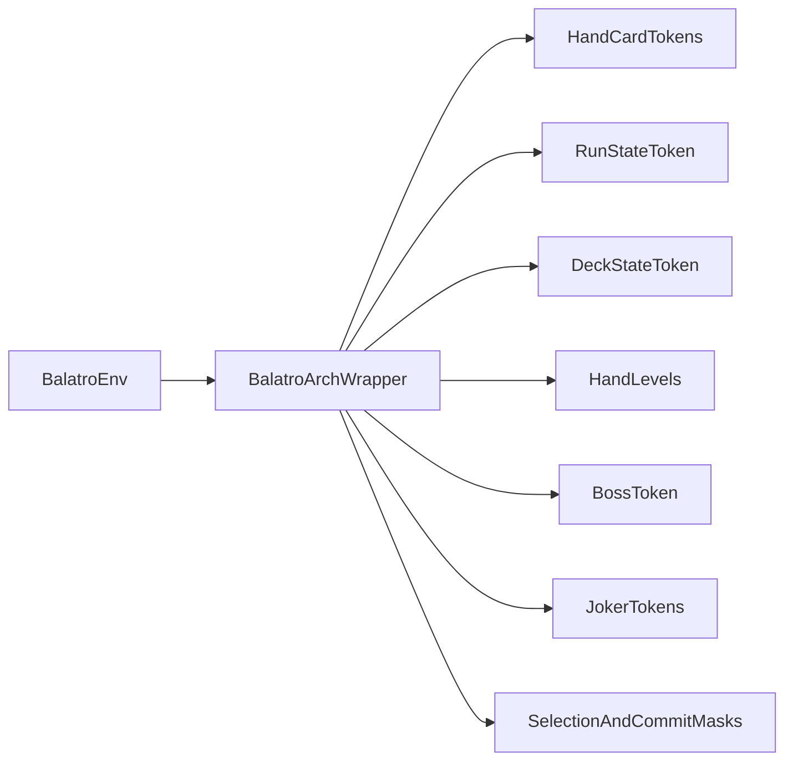

# Gym Interface Report For The Current Architecture

## Executive Summary

The current gym is close enough to support your architecture, but not in its present raw interface. The base simulator in [`/Users/jz/Desktop/2026 spring/CS590 RL/balatro-rl-agent/balatro_gym/balatro_env_2.py`](/Users/jz/Desktop/2026 spring/CS590 RL/balatro-rl-agent/balatro_gym/balatro_env_2.py) already contains most of the game state your transformer needs: hand cards, run-state scalars, hand levels, boss-blind identifiers, joker identifiers, and a flat action mask. The main problem is not missing simulator logic, but a mismatch between the simulator state and the architecture-facing API. In particular, card modifiers are hidden from the observation, deck state is not exposed in a useful form, several declared observation features are not actually returned, and legality masking does not fully match your intended PPO action contract. The most practical path is to keep `BalatroEnv` as the simulator and add a thin architecture-facing wrapper that converts simulator state into the minimal tokenized interface your model actually consumes.

## Architecture-To-Gym Mapping

Your architecture expects the following information blocks:

- hand card tokens
- run-state token
- draw-deck token
- poker hand level token
- boss-blind token
- joker tokens
- per-card selection logits
- play-vs-discard execution head
- PPO-compatible legality handling

The current gym already maps onto those blocks reasonably well, but not always in the right representation.

### 1. Hand card tokens

Your architecture wants:

- one token per visible hand card
- base card identity
- card-local modifiers when they affect scoring
- visibility or face-down status for boss-blind effects

The current gym provides:

- `hand` as an `int8[8]` array in `_get_observation()`
- `selected_cards` as an `8`-slot binary selection mask
- `face_down_cards` as an `8`-slot binary mask

Relevant code:

- [`/Users/jz/Desktop/2026 spring/CS590 RL/balatro-rl-agent/balatro_gym/balatro_env_2.py`](/Users/jz/Desktop/2026 spring/CS590 RL/balatro-rl-agent/balatro_gym/balatro_env_2.py)
- [`/Users/jz/Desktop/2026 spring/CS590 RL/balatro-rl-agent/balatro_gym/cards.py`](/Users/jz/Desktop/2026 spring/CS590 RL/balatro-rl-agent/balatro_gym/cards.py)

What is already aligned:

- The env already has a stable hand length of at most `8`, which matches your per-card head design well.
- The env already encodes cards as stable integer IDs.
- The env already tracks selected slots separately from card identity.
- The env already tracks face-down status separately from identity.

What is missing for the architecture:

- The observation does not expose enhancement, edition, or seal per visible hand slot.
- Those modifier states exist internally in `state.card_states`, but they are not exported in `_get_observation()`.
- This means the model cannot fully reason over the actual scoring semantics of a visible card token.

### 2. Run-state token

Your architecture wants:

- plays/hands left
- discards left
- money
- score progress against current blind
- ante and round context

The current gym provides:

- `money`
- `hands_left`
- `discards_left`
- `chips_needed`
- `round_chips_scored`
- `progress_ratio`
- `ante`
- `round`
- `phase`

What is already aligned:

- All essential run-state scalars exist in the observation.
- You can already build a run-state token directly from existing emitted fields.

What is potentially redundant:

- `progress_ratio` is derivable from `round_chips_scored` and `chips_needed`.
- `chips_scored` is run-total score, which may or may not be useful depending on whether your agent should reason about long-run score accumulation or only current-blind progress.

### 3. Draw-deck token

Your architecture wants:

- a deck-state representation that summarizes future draw potential
- ideally a token or structured representation, not just a scalar count

The current gym provides:

- `deck_size`

What is already aligned:

- Very little. The current env only emits a scalar called `deck_size`.

What is problematic:

- `deck_size` is not a useful draw-pile token for your architecture.
- The env does contain the underlying deck state in Python, but the observation does not expose a meaningful draw-pile representation.
- If your architecture really expects a `Draw Deck State` token, this is the biggest missing observation block.

### 4. Poker hand levels

Your architecture wants:

- the 12 poker hand levels as structured state

The current gym provides:

- `hand_levels` in `_get_observation()`
- `ScoreEngine` in [`/Users/jz/Desktop/2026 spring/CS590 RL/balatro-rl-agent/balatro_gym/scoring_engine.py`](/Users/jz/Desktop/2026 spring/CS590 RL/balatro-rl-agent/balatro_gym/scoring_engine.py)

What is already aligned:

- This is already close to ideal for your architecture.
- A fixed-size `12`-entry vector is exactly the sort of state your `HLE` token can consume.

### 5. Boss-blind token

Your architecture wants:

- boss blind ID
- whether a boss blind is active
- enough context to model debuffs that affect visible cards or action legality

The current gym provides:

- `boss_blind_active`
- `boss_blind_type`
- `face_down_cards`

Relevant code:

- [`/Users/jz/Desktop/2026 spring/CS590 RL/balatro-rl-agent/balatro_gym/boss_blinds.py`](/Users/jz/Desktop/2026 spring/CS590 RL/balatro-rl-agent/balatro_gym/boss_blinds.py)

What is already aligned:

- The current env already exports the two core boss token fields.
- The face-down hand mask is already present and directly useful to your architecture.

What may still be needed:

- If certain boss effects disable jokers or alter strict play legality, the architecture-facing interface should expose those effects explicitly rather than forcing the model to infer them only through penalty feedback.

### 6. Joker tokens

Your architecture wants:

- one token per active joker slot
- stable joker IDs
- padding for missing joker slots

The current gym provides:

- `joker_ids`
- `joker_count`
- `joker_slots`

Relevant code:

- [`/Users/jz/Desktop/2026 spring/CS590 RL/balatro-rl-agent/balatro_gym/jokers.py`](/Users/jz/Desktop/2026 spring/CS590 RL/balatro-rl-agent/balatro_gym/jokers.py)

What is already aligned:

- The gym already provides enough to build a joker token sequence.
- This is one of the strongest matches between the current env and your architecture.

What may still be missing:

- Disabled-joker information under some boss blinds is not clearly part of the numeric observation contract.

### 7. PPO legality handling

Your architecture wants:

- sampled joint action
- validity check for `1` to `5` selected cards
- illegal moves should not destroy PPO stability

The current gym provides:

- `action_mask`
- `_is_valid_action()`
- `_get_action_mask()`
- invalid-action penalty behavior in `step()`

What is already aligned:

- The env already supports masked PPO in the broad sense.
- The env already rejects masked-invalid actions with `-1.0`.

What is not yet aligned with your design:

- `_get_action_mask()` only checks whether any cards are selected before enabling `PLAY_HAND`.
- It does not enforce your intended strict `1..5` legality contract.
- It also does not factor the mask into card-selection head masks and execution-head masks, which would make your architecture easier to train.

## Minimal Gym Contract For This Architecture

This section defines the minimal environment contract needed for the full architecture to work cleanly.

The guiding principle is:

- keep only the state that the model cannot infer cheaply from token attention
- expose all state that materially changes action legality or scoring
- avoid heuristic summary features that duplicate what attention can learn

### Minimal observation groups

The gym only needs to provide these groups for the combat/play architecture shown in your diagram.

#### A. Hand card tokens

Required fields per visible hand slot:

- `card_id`
- `is_empty`
- `is_face_down`
- `enhancement_id`
- `edition_id`
- `seal_id`
- `is_selected`

Why this is minimal:

- `card_id` provides rank and suit identity.
- `enhancement_id`, `edition_id`, and `seal_id` are necessary because they directly affect scoring and future value.
- `is_face_down` is needed for boss-blind information to be local to the card token.
- `is_selected` lets the network reason over the current incremental selection state.

Recommended tensor form:

- shape `(8, feature_dim)`
- fixed slot order matching hand order

#### B. Run-state token

Required scalar fields:

- `money`
- `hands_left`
- `discards_left`
- `chips_needed`
- `round_chips_scored`
- `ante`
- `round`
- `phase`

Optional but still acceptable:

- `progress_ratio`

Why this is minimal:

- These fields define current combat pressure, resource availability, and progression state.
- They are enough to decide between greedy score pushing, conservative discarding, and economy-preserving play.

#### C. Draw-deck token

Minimum viable version:

- `draw_pile_size`
- `remaining_rank_histogram`
- `remaining_suit_histogram`

Better version, if you want stronger forward-looking play:

- ordered undrawn card tokens, or a capped ordered prefix of the draw pile

Why this is minimal:

- Your architecture explicitly includes a `Draw Deck State` token.
- The current scalar `deck_size` is too weak to play that role.
- A histogram-based token is a feasible compromise if full ordered deck exposure is too simulator-specific.

#### D. Hand-level token

Required fields:

- `hand_levels[12]`

This block is already good as-is.

#### E. Boss token

Required fields:

- `boss_blind_active`
- `boss_blind_type`

Optional useful additions:

- `disabled_joker_count`
- compact rule flags if some boss mechanics materially change legality

#### F. Joker tokens

Required fields per joker slot:

- `joker_id`
- `is_empty`
- `is_disabled`

Why this is minimal:

- Your modifier branch uses joker tokens directly.
- Since you already have attention over modifiers, you do not need handcrafted synergy features.

### Minimal action interface

For your architecture, the minimal clean action contract should be:

#### Card-selection action head

- one binary decision per visible hand slot
- semantically: select / do not select

or, if you keep sequential toggling:

- one categorical slot action over `8` slots that toggles one slot at a time

The first option matches your diagram more directly. The second option is closer to the current env.

#### Execution head

- `PLAY`
- `DISCARD`

This head should only be sampled when the current selection is legally executable.

#### Legality rules

The environment-facing legality contract should enforce:

- `1 <= selected_count <= 5` for `PLAY`
- `1 <= selected_count <= hand_size` for `DISCARD`
- boss-specific legality should be reflected in the mask whenever possible

### Minimal helper functions and masks

To support your full architecture cleanly, the gym should expose these helper outputs even if they are only wrapper-level derived features.

#### Required helper outputs

- `selection_mask[8]`
  Which card slots may currently be toggled or chosen.

- `play_allowed`
  Boolean mask for the execution head.

- `discard_allowed`
  Boolean mask for the execution head.

- `selected_count`
  Needed for legality logic and for some model-side conditioning.

- `phase`
  So the model can gate behavior without guessing from sparse masks.

#### Strongly recommended helper outputs

- `play_legality_reason`
  Optional debug info for development, not necessarily part of the training tensor API.

- `draw_pile_state()`
  Wrapper helper that builds the architecture-facing draw-deck token from simulator internals.

- `hand_card_token_view()`
  Wrapper helper that aligns visible hand cards with `CardState`.

## Unnecessary Or Redundant Current Gym Features

Based on your architecture, many current or planned scalar summary features are unnecessary in the architecture-facing API.

### Features that are likely unnecessary

- `joker_synergy_score`
- `hand_potential_scores`
- `risk_level`
- `economy_health`
- `blind_difficulty`
- `win_probability`
- `has_mult_jokers`
- `has_chip_jokers`
- `has_xmult_jokers`
- `has_economy_jokers`
- `straight_potential`
- `flush_potential`
- `rank_counts`
- `suit_counts`
- `hand_one_hot`
- `hand_suits`
- `hand_ranks`

### Why they are unnecessary for this architecture

- Your architecture already has token attention over cards, jokers, boss state, and hand levels.
- Many of these fields are heuristic summaries of relationships that attention should learn directly.
- Keeping them encourages the policy to rely on hand-engineered shortcuts instead of learning the interaction structure you explicitly designed the model to capture.
- Some of them, such as `win_probability`, are not only redundant but also potentially unstable because they encode a handcrafted approximation of long-horizon value.

### Features that are acceptable but redundant

- `progress_ratio`
  Derivable from `round_chips_scored / chips_needed`.

- `joker_count`
  Derivable from joker-slot padding mask if joker tokens are already provided.

- `consumable_count`
  Same logic for future shop/consumable architectures.

## Current Blockers And Mismatches

These are the main reasons the current gym interface is not yet a clean fit for your architecture.

### 1. Observation-space mismatch

The biggest interface bug is that `_create_observation_space()` declares many features that `_get_observation()` does not actually return.

Relevant files:

- [`/Users/jz/Desktop/2026 spring/CS590 RL/balatro-rl-agent/balatro_gym/balatro_env_2.py`](/Users/jz/Desktop/2026 spring/CS590 RL/balatro-rl-agent/balatro_gym/balatro_env_2.py)

Why this matters:

- Any wrapper or trainer that trusts the declared observation space may break or silently receive inconsistent state.
- This makes downstream model design harder than it needs to be.

### 2. Missing per-card modifier exposure

The simulator already tracks modifier state via `CardState`, but the observation only exports the base card ID.

Why this matters:

- Your card encoder cannot distinguish a plain `Q hearts` from a glass, steel, or sealed `Q hearts`.
- That is a major mismatch between simulator semantics and model inputs.

### 3. Missing useful deck-state representation

The current `deck_size` does not satisfy your architecture's intended `Draw Deck State`.

Why this matters:

- Your model design expects a deck-summary token.
- The simulator currently does not expose enough information to build one directly from the emitted observation.

### 4. Incomplete legality masking

The current mask enables `PLAY_HAND` whenever any cards are selected.

Why this matters:

- Your architecture expects validity around `1` to `5` selected cards.
- The current env is too permissive at the masking layer and relies too much on downstream penalty logic.
- This increases wasted PPO samples.

### 5. Flat action mask is not architecture-native

The current env is built around a flat `Discrete(60)` action space.

Why this matters:

- Your model uses a structured action factorization: per-card selection plus play/discard execution.
- A wrapper should bridge the model's structured policy outputs to the env's flat actions.

### 6. Current gym includes unnecessary heuristic features

Even if fully implemented, many of the declared advanced fields do not belong in the minimal architecture-facing interface.

Why this matters:

- They blur the line between simulator state and model-side inductive bias.
- They make ablation and architecture evaluation harder.

## Recommended Technical Direction

Do not rewrite the full simulator first.

Instead, add a thin wrapper around `BalatroEnv` that converts simulator state into the exact tokenized contract your architecture expects.

Recommended wrapper name:

- `BalatroArchWrapper`

Alternative acceptable name:

- `BalatroArchEnv`

The wrapper should sit between the simulator and PPO training code.

## Feasible Gym Update Proposal

This section proposes the minimum gym-side changes needed to make your architecture trainable in a clean and stable way.

### Option A: Recommended approach

Keep `BalatroEnv` unchanged as the simulator, and implement `BalatroArchWrapper`.

Responsibilities of the wrapper:

- read raw simulator state from `BalatroEnv`
- expose only the minimal observation groups your model consumes
- convert visible hand cards into full card tokens
- convert deck internals into a deck-summary token
- convert `joker_ids` into padded joker tokens with disabled flags
- expose factorized masks for:
  - card selection
  - play legality
  - discard legality
- translate structured model actions into flat env actions

Why this is the best first step:

- lowest simulator risk
- easiest to test
- preserves backward compatibility with the current training scripts
- lets you iterate on model inputs without destabilizing base game logic

### Option B: Directly update `BalatroEnv`

You could instead rewrite the raw env observation space to match your architecture directly.

Why this is weaker as a first step:

- it couples simulator internals to one specific model architecture
- it risks breaking current scripts that assume the existing observation structure
- it makes it harder to compare raw-gym and architecture-wrapper training setups

### Specific update tasks the wrapper or env must implement

#### 1. Hand card token export

Expose, per visible hand slot:

- `card_id`
- `enhancement_id`
- `edition_id`
- `seal_id`
- `is_face_down`
- `is_selected`
- `is_empty`

#### 2. Deck token export

Implement one of the following:

- histogram token over remaining ranks and suits
- tokenized ordered draw pile
- capped tokenized draw-pile prefix plus summary histogram

Recommended first version:

- rank histogram
- suit histogram
- remaining draw count

This is minimal, cheap, and enough to honor the architecture block without overcomplicating the wrapper.

#### 3. Factorized masks

Provide:

- `card_select_mask`
- `play_allowed`
- `discard_allowed`

These should be derived from one shared legality function so they remain consistent with the flat env.

#### 4. Tighten legality semantics

The wrapper should implement strict legality for the model-facing action contract:

- `PLAY` invalid unless `1..5` cards are selected
- `DISCARD` invalid unless at least one card is selected and discards remain

If needed, the wrapper can prevent illegal `PLAY` from ever being translated into a flat `PLAY_HAND` env action.

#### 5. Observation cleanup

The wrapper should not expose the following to the architecture by default:

- heuristic synergy indicators
- handcrafted value proxies
- redundant summary features that duplicate token reasoning

## Minimal Functions The Gym Needs To Provide

For your full architecture to work, the minimal gym-facing functional contract is:

### Required environment methods

- `reset()`
- `step(action)`
- `save_state()` if you want robust debugging or rollout reproducibility
- `load_state()` if you want exact replay/testing support

### Required accessible internal state or helper access

- visible hand cards in stable slot order
- per-card modifier state aligned with visible hand slots
- joker IDs in stable slot order
- hand levels
- boss-blind state
- run-state scalars
- enough deck internals to build a deck token
- legality information sufficient to build factorized masks

### Required model-facing wrapper methods

- `get_arch_observation()`
- `get_arch_masks()`
- `translate_arch_action_to_env_action()`

These can be wrapper internals rather than public methods, but they describe the functionality that must exist somewhere.

## Recommended Implementation Sequence

### Phase 1: Make the interface honest

1. Audit the raw env observation contract.
2. Decide whether unimplemented declared observation fields should be removed from the raw env or ignored by the wrapper.
3. Document that the wrapper, not the raw env, is the architecture-facing API.

### Phase 2: Add the wrapper

1. Create `BalatroArchWrapper`.
2. Export minimal observation groups:
   - hand tokens
   - run token
   - deck token
   - hand levels
   - boss token
   - joker tokens
3. Export factorized legality masks.

### Phase 3: Tighten legality behavior

1. Enforce `1..5` play legality in the wrapper-facing action contract.
2. Prevent invalid structured actions from being translated into simulator actions.
3. Keep penalty behavior only as a fallback, not the primary legality mechanism.

### Phase 4: Integrate with PPO training

1. Update the training stack to consume structured observations.
2. Use card-selection logits plus execution logits directly.
3. Keep the flat env action space hidden behind the wrapper translation layer.

### Phase 5: Optional cleanup

1. Remove unused heuristic observation fields from the raw env, or leave them undocumented.
2. Add wrapper tests for observation shape, mask correctness, and action translation.

## Final Recommendation

The gym does not need to become more feature-rich for your architecture. It needs to become more structurally aligned.

The minimal useful gym for your architecture is:

- a simulator that exposes true game state
- a wrapper that converts that state into:
  - hand card tokens
  - joker tokens
  - boss token
  - run-state token
  - deck-state token
  - hand-level token
  - factorized action masks

The gym features you do not need are mostly handcrafted summary statistics that try to precompute relationships your transformer is already designed to learn. The main implementation priority is therefore not adding more summaries, but exposing the existing simulator state in the correct tokenized and legality-aware form.
